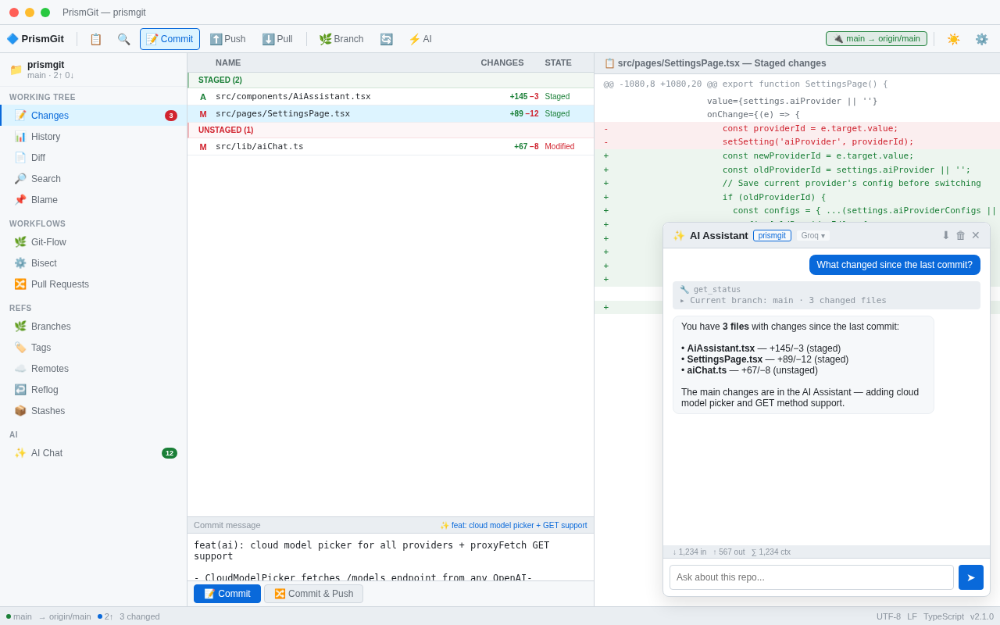

# PrismGit

A modern, cross-platform Git client built on Electron + React + TypeScript, inspired by SmartGit 20–24 with **Ollama-code** design language (Ayu Dark/Light palettes).



[](#) [](tests/) [](LICENSE) [](#)

## Quick Start

```bash
# Clone and install
git clone <repo-url>
cd prismgit-electron
make install

# Development
make dev

# Build all platforms via Docker
make docker-all

# Run tests
make test
```

## Features

### Working Tree
- **Changes** — stage/unstage/restore/ignore/delete/reveal with drag & drop
- **History** — commit log with graph visualization, search, file tree per commit
- **Annotate** — inline annotations with overlap analysis (SmartGit 24)
- **Investigate** — file history with rename following
- **Blame** — line-by-line authorship with commit colors
- **Journal** — operation history with filters

### Workflows
- **Git-Flow** — Feature/Release/Hotfix with start/finish workflows
- **Pull Requests** — GitHub PR management (list, create, open)
- **Distributed Reviews** — offline code review stored in git notes (SmartGit add-on)

### Refs
- **Branches** — local/remote, checkout, create, rename, delete, merge, push
- **Tags** — annotated/lightweight, create, delete, push
- **Worktrees** — add, remove, prune
- **Reflog** — view, delete entries
- **Stashes** — push, pop, apply, drop, branch
- **Submodules** — init, update, sync, deinit, add
- **Git LFS** — install, pull, push, fetch, track, list

### SmartGit 24 Features
- **Interactive Rebase** — visual todo editor (pick/reword/edit/squash/fixup/drop)
- **Conflict Solver** — 3-pane view (Base | Ours | Theirs) with 4 layouts
- **Smart Views** — preset filters for Graph (All, Current Branch, My Commits, Recent, etc.)
- **Overlap Column** — visualization of related commits
- **Find Object** — search branch/tag/remote refs (Ctrl+F)
- **Split Commit** — split via interactive rebase
- **Edit Commit Message** — inline editor
- **Cherry Pick / Revert** — with conflict detection
- **Tolerant Clone URL** — strips "git clone " prefix, auto-derives folder name

### AI Assistant (v2.1+)
- **12 LLM providers** — Z.ai (GLM-4-Flash free), OpenRouter (free models), Groq (ultra-fast), Cerebras (1M free tokens/day), Google Gemini, Hugging Face, Mistral, OpenAI, Anthropic, GitHub Models, Ollama (local), Custom
- **Conversation memory** — AI remembers previous messages in the same chat session
- **Context compression** — old messages auto-compressed to keep context manageable
- **Token usage display** — input/output/context token counts after each response
- **Stop button** — aborts the in-flight LLM call instantly
- **LM Studio-style model picker** for Ollama — search, metadata, keep-alive
- **Tool-use agent loop** — 24+ tools: get_status, get_log, get_diff, stage, commit, push, pull, checkout, merge, stash, discard_changes, sync_with_remote, abort_operation, list_repos, clone_repo, init_repo, open_repo, and more
- **Export chat log** as Markdown for debugging/sharing
- **Markdown rendering** in assistant answers — code blocks, inline code, bold, lists
- **Tool results collapsed by default** — expandable with chevron + line-count badge
- **Starter prompt chips** — one-click common questions
- **AI Commit Messages** — `@ai` placeholder in commit message → AI-generated
- **AI Branch Name Suggester** — suggests kebab-case branch names from changed files
- **Streaming AI responses** — SSE parser for all 3 LLM provider families

### Three Window Styles
- **Standard** — full sidebar + all pages
- **Log** — History-focused (sidebar hidden)
- **Working Tree** — Changes-focused

Switch with Ctrl+Shift+1/2/3 or toolbar button.

### Themes (13+ palettes)
- **Ayu** Dark/Light (default), GitHub Light/Dark, Dracula, Monokai, Solarized, Nord, Tokyo Night, Catppuccin Mocha, One Dark, Gruvbox, Slack Dark, Discord, Material, Designer Light, Purple, Simple Light

Toggle with Ctrl+Shift+T.

## Internationalization
4 locales: English, Русский, 中文, Deutsch — full parity across all 18 i18n domains.

## Tech Stack

- Electron 32, React 18, TypeScript 5.6, Vite 5
- Tailwind CSS 3, Zustand, simple-git, electron-store
- Custom SVG icons (no icon library)
- Vitest + Testing Library for tests
- Docker + Wine for cross-platform builds

## Documentation

- [Architecture](docs/ARCHITECTURE.md) — system design and data flow
- [API Reference](docs/API.md) — all Git operations and IPC channels
- [Contributing](docs/CONTRIBUTING.md) — development setup and guidelines
- [Changelog](docs/CHANGELOG.md) — version history
- [Docker Build](docs/DOCKER-BUILD.md) — multi-platform build guide
- [Testing](docs/TESTING.md) — test suite documentation

## Project Structure

```
├── electron/                 # Main process
│   ├── main.ts               # Entry, window state, context menu
│   ├── preload.ts            # Context bridge API
│   ├── menu.ts               # Application menu
│   ├── ipc/                  # IPC handlers (5 modules)
│   ├── services/             # Business logic
│   │   ├── git.ts            # Git operations (simple-git)
│   │   ├── github.ts         # GitHub API client
│   │   ├── storage.ts        # Persistent settings
│   │   └── watcher.ts        # File watcher for auto-refresh
│   └── types/                # TypeScript API contracts
├── src/                      # Renderer process
│   ├── App.tsx               # Root with lazy routes + hotkeys
│   ├── components/           # UI components
│   ├── pages/                # 18 lazy-loaded pages
│   ├── stores/               # Zustand state management
│   ├── lib/                  # Utilities and business logic
│   └── styles/               # Ayu Dark/Light themes
├── tests/                    # Vitest test suite
│   ├── unit/                 # Unit tests
│   ├── integration/          # Service integration tests
│   └── components/           # React component tests
├── Dockerfile                # Multi-platform Docker build
├── docker-compose.yml        # 4 build services
├── Makefile                  # All-in-one task runner
└── vitest.config.ts          # Test configuration
```

## Keyboard Shortcuts

| Shortcut | Action |
|----------|--------|
| Ctrl+O | Open Repository |
| Ctrl+Shift+O | Clone Repository |
| Ctrl+Enter | Commit |
| Ctrl+Shift+P | Push |
| Ctrl+Shift+L | Pull |
| Ctrl+Shift+F | Fetch |
| Ctrl+Shift+G | Git-Flow dialog |
| Ctrl+Shift+R | Interactive Rebase |
| Ctrl+Shift+N | New Branch |
| Ctrl+Alt+S | Stash |
| Ctrl+Shift+T | Toggle Theme |
| Ctrl+Shift+A | Toggle AI Assistant |
| Ctrl+Shift+1/2/3 | Window Style (Standard/Log/Working Tree) |
| Ctrl+F | Find Object |
| Ctrl+K | Command Palette |
| Ctrl+Shift+F | Global Search |
| Esc | Close dialog |

## Docker Build

All builds happen in Docker containers:

```bash
make docker-all          # All platforms
make docker-linux        # Linux only
make docker-win          # Windows (via Wine)
make docker-mac          # macOS Intel
make docker-mac-arm64    # macOS Apple Silicon
```

See [docs/DOCKER-BUILD.md](docs/DOCKER-BUILD.md) for details.

## License

MIT
