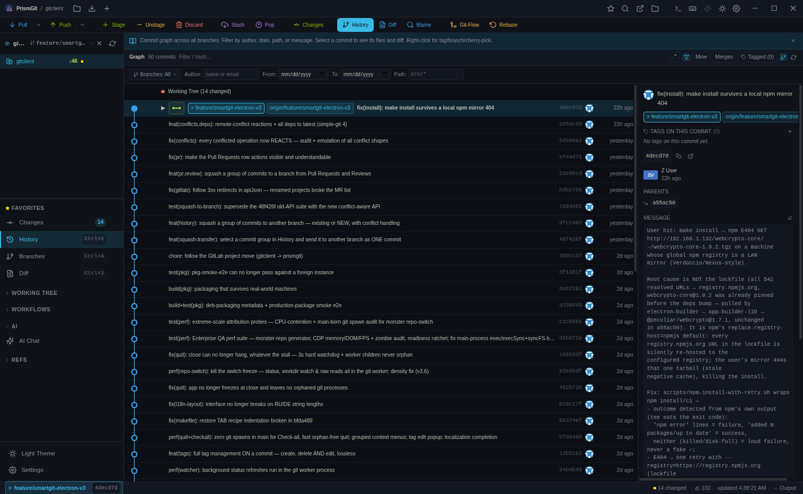
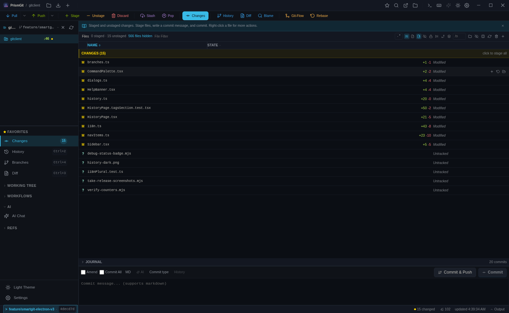
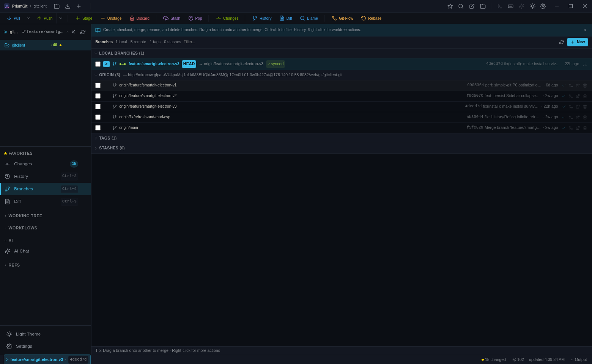
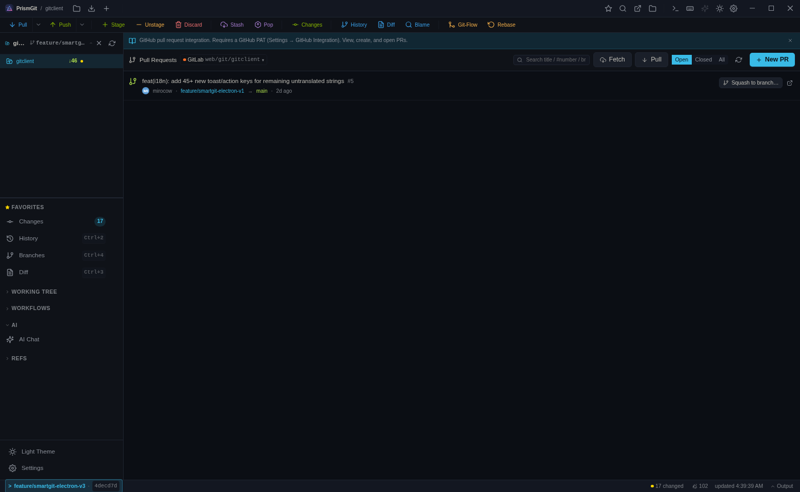
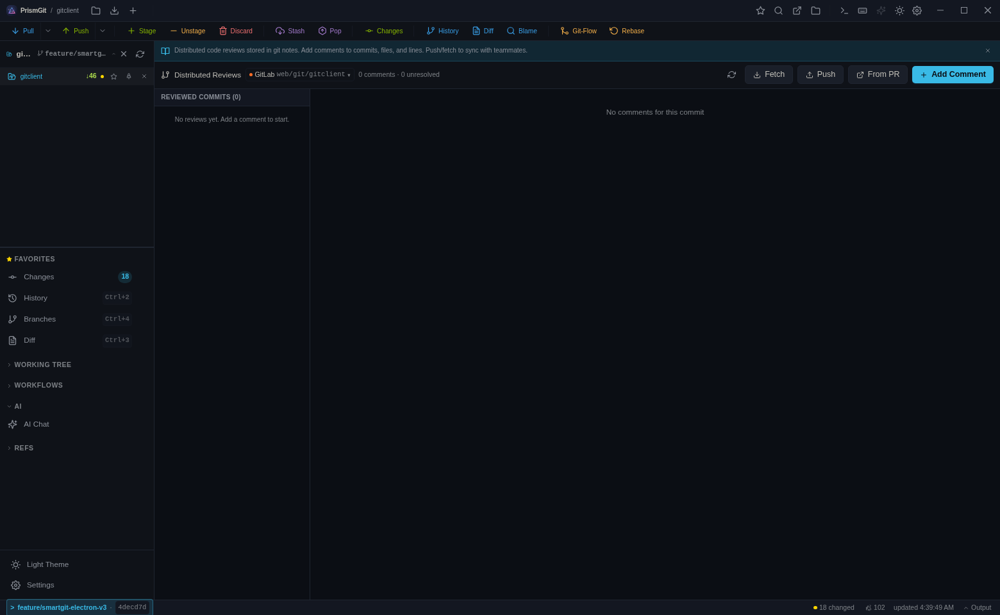
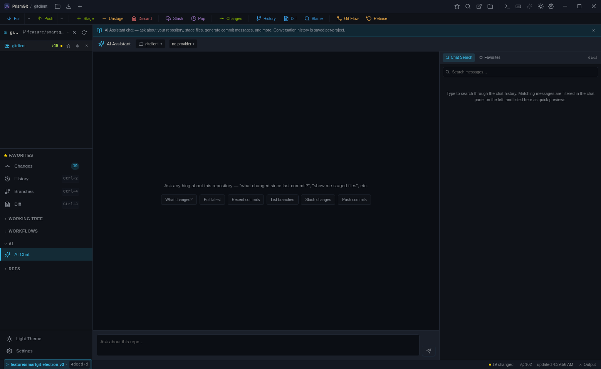
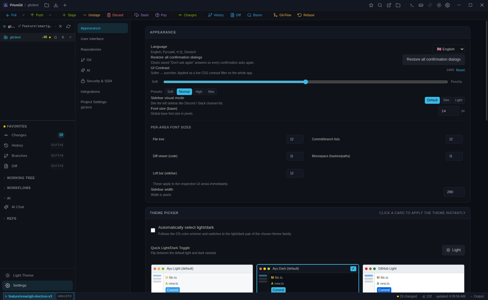
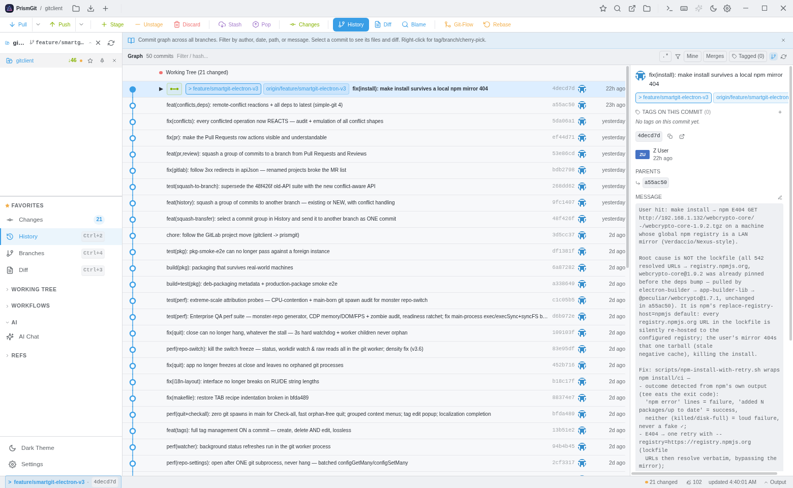

# PrismGit

**[English](README.md)** | [Русский](README.ru.md) | [中文](README.zh.md) | [Deutsch](README.de.md)

A modern, cross-platform Git client built on Electron + React + TypeScript, inspired by SmartGit 20–24 with **Ollama-code** design language (Ayu Dark/Light palettes).



[](#) [](tests/) [](LICENSE) [](#) [](#)

## Quick Start

```bash
# Clone and install
git clone <repo-url>
cd prismgit-electron
make install        # survives a local npm-mirror 404 — auto-retries via registry.npmjs.org

# Development
make dev

# Build for current platform
make package

# Run tests
make test

# Cross-platform build via Docker
make docker-all
```

## Screenshots

| | |
|:---:|:---:|
|  |  |
| **History** — full-branch graph, lazy loading, filters | **Changes** — staged/unstaged groups, drag & drop |
|  |  |
| **Branches** — local/remote, sync indicators | **Pull Requests** — GitHub PRs + GitLab MRs |
|  |  |
| **Reviews** — 4-tab code review surface | **AI Assistant** — 12+ providers, 24+ git tools |
|  |  |
| **Settings** — 20+ themes, 4 locales | **History — Light theme** (Ayu Light) |

## What's New in 2.2.0

- **Every conflicted operation now REACTS** — pull (merge/rebase/ff-only), merge, rebase, cherry-pick, revert, stash pop/apply, git-flow finish, squash-to-branch and patch 3-way all jump to the Conflict Solver with an in-progress banner (Continue / Skip / Abort) and an operation-specific warning. Git-Flow never continues past a conflicted merge; stash pop never reports false success.
- **Push rejection recovery** — non-fast-forward, stale force-with-lease, protected-branch and policy rejections open a dialog with per-cause actions: «Pull and merge» (+ auto push retry), force-with-lease, «Fetch and retry», create a merge request. PR/MR lists show provider-reported conflict badges.
- **Squash a group of commits to another branch** — from History or from Pull Requests/Reviews, into an existing or a NEW branch, conflict-aware.
- **Counter audit** — History's «Tagged (N)» chip now counts tagged commits *in view* (matching what the filter shows), per-commit tag counts are exact, Branches' summary pluralizes correctly in Russian (`1 локальная · 2 локальные · 5 локальных`), and the sidebar follows the restored locale at startup.
- **Secrets manager** (Settings → Security) — list/copy/replace/delete every encrypted vault entry, metadata-only rendering.
- **All dependencies at latest** — simple-git 4, Vite 8, Vitest 5, Tailwind 4, React 19, Electron 44 — plus `make install` that self-heals a local npm mirror 404.
- **Performance & stability** — orphan-free 3 s quit watchdog, repo-switch and status refreshes in the git worker, render isolation for keystroke-level updates, remote-check fetch-storm fix, deb packaging + production smoke E2E.

Full history: [docs/CHANGELOG.md](docs/CHANGELOG.md)

## Features

### Working Tree
- **Changes** — stage/unstage/restore/ignore/delete/reveal with drag & drop; configurable commit journal (`git log -N` cadence + count in Settings)
- **Diff** — lazy-loaded with 20-entry LRU cache, 150ms debounce, editable (open in external editor → prompt to stage)
- **History** — commit log with graph visualization, search, file tree per commit, author/date/path filters, multi-branch selection, tagged-commits filter
- **Annotate** — inline annotations with overlap analysis (SmartGit 24)
- **Investigate** — file history with rename following
- **Blame** — line-by-line authorship with commit colors

### Conflict Handling
- **Conflict Solver** — 3-pane view (Base | Ours | Theirs) with 4 layouts; take ours/theirs per-file; editable center pane
- **Uniform conflict reactions** — ANY conflicted operation (pull merge/rebase, merge, rebase, cherry-pick, revert, stash pop/apply, git-flow finish, squash-to-branch, patch 3-way, AI auto-stash pop) navigates to the resolver with the in-progress banner (Continue/Skip/Abort) + Conflicts section + operation-specific toast
- **Push Rejection Dialog** — non-fast-forward → «Pull and merge» + automatic push retry; stale force-with-lease → fetch + retry; protected branch → create MR/PR; policy blocks explained
- **PR conflict badges** — GitLab `merge_status` / GitHub `mergeable` shown in PR lists and the review header; Merge button disabled when unmergeable
- **Honest push verification** — post-push `ls-remote` check catches silent server-side rejections (hooks, proxies, wrong branch)

### Workflows
- **Git-Flow** — Feature/Release/Hotfix/Fix/Support with start/finish workflows; AVH-style prefix configuration; init banner; finish flows stop at a conflicted merge (never tag/delete/push past a conflict)
- **Pull Requests** — unified GitHub PR + GitLab MR management (list, create, open, approve, merge, close); labeled row actions + right-click menu; group squash to a branch
- **Reviews** — full code review surface for selected PR/MR with 4 tabs:
  - **Overview** — description (markdown rendered), summary stats (files/commits/comments)
  - **Commits** — list of commits in the PR with sha, message, author, date
  - **Files** — changed files with status badges, +/- counts, unified diff patch viewer
  - **Discussion** — issue-style comments + comment input (Cmd/Ctrl+Enter to post)
- **Distributed Reviews** — offline code review stored in git notes (`refs/notes/reviews`), push/fetch for team sharing
- **Squash to branch** — select a commit group in History (or from a PR) and land it on another branch as ONE commit — existing or new branch, conflict-aware

### Provider Integration
- **Unified provider store** — single shared selection between Pull Requests and Reviews pages
- **GitHub** — PAT auth, list/create/merge/close PRs, get PR detail/files/commits/comments
- **GitLab** — PAT auth (cloud + self-hosted), list/create/merge MRs, get MR detail/changes/notes/commits; direct project lookup by path_with_namespace; follows 3xx redirects (renamed projects)
- **Provider chip** — dropdown switcher in page headers (AI Assistant style); auto-detects from remote URL; manual override persists across pages
- **API call logging** — all GitHub/GitLab HTTP requests visible in the Output panel with method, path, status code, duration

### Refs
- **Branches** — local/remote, checkout, create, rename, delete, merge, push; warning indicators (gone, local-only, dirty); drag a branch onto another to merge
- **Tags** — annotated/lightweight, create, delete, push; tag grouping by RegEx; full tag management ON a commit — create, delete AND edit, lossless
- **Remotes** — add/remove/edit, credential management, background fetch opt-in per remote
- **Worktrees** — add, remove, prune (from the Branches context menu)
- **Reflog** — view, delete entries, cherry-pick/reset actions, action-type filters
- **Stashes** — push, pop, apply, drop, branch, rename; pop/apply conflicts surface the resolver (the stash is kept)
- **Submodules** — init, update, sync, deinit, add
- **Git LFS** — install, pull, push, fetch, track, list, lock/unlock, fsck, untrack
- **Recyclable** — recover unreachable commits before they expire (90 days)

### SmartGit 24 Features
- **Interactive Rebase** — visual todo editor (pick/reword/edit/squash/fixup/drop)
- **Conflict Solver** — 3-pane view (Base | Ours | Theirs) with 4 layouts; take ours/theirs per-file
- **Smart Views** — preset filters for Graph (All, Current Branch, My Commits, Recent, etc.)
- **Overlap Column** — visualization of related commits
- **Find Object** — search branch/tag/remote refs (Ctrl+F)
- **Split Commit** — split via interactive rebase
- **Edit Commit Message** — inline editor
- **Cherry Pick / Revert** — with conflict detection and state management
- **Tolerant Clone URL** — strips "git clone " prefix, auto-derives folder name

### AI Assistant
- **12+ LLM providers** — Z.ai (GLM-4-Flash free), OpenRouter (free models), Groq (ultra-fast), Cerebras (1M free tokens/day), Google Gemini, Hugging Face, Mistral, OpenAI, Anthropic, GitHub Models, Ollama (local), LM Studio, vLLM, Custom OpenAI-compatible
- **Unlimited provider registry** — add as many instances of any provider type as you need
- **Provider switcher** — switch mid-conversation; history preserved
- **Conversation memory** — AI remembers previous messages in the same chat session
- **Context compression** — old messages auto-compressed (configurable max context size)
- **Token usage display** — input/output/context token counts after each response
- **Stop button** — aborts the in-flight LLM call instantly
- **AI Guard** — configurable allow/confirm/deny for destructive git actions (reset --hard, force push, clean, amend, stash drop)
- **Tool limits** — configurable max log commits, diff files, context size, request timeout
- **Tool-use agent loop** — 24+ tools: get_status, get_log, get_diff, stage, commit, push, pull, checkout, merge, stash, discard_changes, sync_with_remote, abort_operation, list_repos, clone_repo, init_repo, open_repo, read_file, list_files, and more
- **Export chat log** as Markdown for debugging/sharing
- **Markdown rendering** in assistant answers — code blocks, inline code, bold, lists
- **Starter prompt chips** — one-click common questions
- **AI Commit Messages** — `@ai` placeholder in commit message → AI-generated
- **AI Branch Name Suggester** — suggests kebab-case branch names from changed files
- **Streaming AI responses** — SSE parser for all 3 LLM provider families
- **Favorites** — save and reuse parts of conversations

### Security
- **Encrypted credential vault** — tokens, remote passwords, AI keys, SSH passphrases stored via `safeStorage`
- **Secrets manager** (Settings → Security) — metadata-only list of every vault entry; copy / replace / delete per entry; add secret manually
- **Default commit author** (Settings → Git) — applied to new clones/inits; `commit()` falls back to it when no identity is configured
- **AI Guard** — confirmation gate for destructive git actions

### Three Window Styles
- **Standard** — full sidebar + all pages
- **Log** — History-focused (sidebar hidden)
- **Working Tree** — Changes-focused

Switch with Ctrl+Shift+1/2/3 or toolbar button.

### Themes (20+ palettes)
- **Ayu** Dark/Light (default), GitHub Light/Dark, Dracula, Monokai, Solarized, Nord, Tokyo Night, Catppuccin Mocha, One Dark, Gruvbox, Slack Dark, Discord, Material, Designer Light, Purple, Simple Light

Toggle with Ctrl+Shift+T. Auto light/dark follows the OS color scheme.

### Performance & Settings
- **Git performance** — `feature.manyFiles`, `core.fsmonitor`, `fetch.writeCommitGraph` configurable in Settings → Git (applied via GIT_CONFIG env override, no global config changes)
- **Configurable journal** — Changes page commit journal count (5–100) and refresh interval (0–300s) to control `git log -N` frequency
- **History auto-refresh** — opt-in periodic `git log` with configurable interval (min 30s)
- **Auto-push** — opt-in periodic push of outgoing commits
- **Per-remote background fetch** — opt-in per remote via checkbox in Repository Settings
- **Adaptive polling** — boost mode (30s) after git mutations, baseline (120s) otherwise; pauses when window blurred; remote-status fetch runs in a dedicated utility process
- **Repo switch in the git worker** — status, workdir watch and raw reads off the UI thread; orphan-free 3 s quit watchdog

## Internationalization

4 locales with full parity across all i18n domains:
- **English** (en) — default
- **Русский** (ru) — with proper Russian plural forms (`{n|one|few|many}` engine: «1 локальная · 2 локальные · 5 локальных»)
- **中文** (zh)
- **Deutsch** (de)

The i18n parity test (`tests/unit/i18nParity.test.ts`) enforces that all 4 locales have identical key sets, and the plural engine keeps en/zh/de rendering byte-identical to the plain-placeholder behavior. The sidebar, command palette and help banners follow the locale restored from settings at startup.

## Output Panel

The Output panel (Command Log) captures:
- **Git commands** — every `git <args>` child process with stdout/stderr, exit code, duration
- **API calls** — GitHub/GitLab HTTP requests logged as synthetic entries (`api gitlab GET /projects/12/merge_requests/5`)
- **User vs System filter** — only user-initiated commands shown by default; toggle "System" to see background polling
- **Search** — filter by command text, stdout, or stderr

## Tech Stack

- Electron 44, React 19, TypeScript 7, Vite 8
- Tailwind CSS 4, Zustand 5, simple-git 4, electron-store
- Custom SVG icons (no icon library)
- Vitest 5 + Testing Library — 1963 tests (unit / integration with real git / component)
- Live E2E harnesses — conflict reactions, push rejections, counters audit (running app + VLM-verified screenshots)
- Docker + Wine for cross-platform builds

## Documentation

- [Changelog](docs/CHANGELOG.md) — version history · [RU](docs/CHANGELOG.ru.md) · [ZH](docs/CHANGELOG.zh.md) · [DE](docs/CHANGELOG.de.md)
- [Architecture](docs/ARCHITECTURE.md) — system design and data flow
- [API Reference](docs/API.md) — all Git operations and IPC channels
- [Contributing](docs/CONTRIBUTING.md) — development setup and guidelines
- [Docker Build](docs/DOCKER-BUILD.md) — multi-platform build guide
- [Testing](docs/TESTING.md) — test suite documentation

## Project Structure

```
├── electron/                 # Main process
│   ├── main.ts               # Entry, window state, context menu
│   ├── preload.ts            # Context bridge API
│   ├── menu.ts               # Application menu
│   ├── ipc/                  # IPC handlers
│   ├── services/             # Business logic
│   │   ├── git.ts            # Git operations (simple-git, 6900+ lines)
│   │   ├── github.ts         # GitHub API client
│   │   ├── gitlab.ts         # GitLab API client (self-hosted + cloud)
│   │   ├── commandLog.ts     # Git command + API call logger
│   │   ├── storage.ts        # Persistent settings
│   │   └── watcher.ts        # File watcher for auto-refresh
│   └── types/                # TypeScript API contracts
├── src/                      # Renderer process
│   ├── App.tsx               # Root with lazy routes + hotkeys
│   ├── components/           # UI components (55+ files)
│   ├── pages/                # Lazy-loaded pages
│   ├── stores/               # Zustand state management (12 stores)
│   ├── lib/                  # Utilities and business logic
│   └── styles/               # Ayu Dark/Light + 20 themes
├── tests/                    # Vitest test suite (1963 tests)
│   ├── unit/                 # Unit tests (i18n parity, gitflow, etc.)
│   ├── integration/          # Service integration tests (real git)
│   └── components/           # React component tests
├── scripts/                  # Build + utility + live E2E scripts
├── Dockerfile                # Multi-platform Docker build
├── docker-compose.yml        # 4 build services
├── Makefile                  # All-in-one task runner
└── vitest.config.mts         # Test configuration
```

## Keyboard Shortcuts

| Shortcut | Action |
|----------|--------|
| Ctrl+O | Open Repository |
| Ctrl+Shift+O | Clone Repository |
| Ctrl+Enter | Commit |
| Ctrl+Shift+P | Push |
| Ctrl+Shift+L | Pull |
| Ctrl+Shift+F | Fetch / Global Search |
| Ctrl+Shift+G | Git-Flow dialog |
| Ctrl+Shift+R | Interactive Rebase |
| Ctrl+Shift+N | New Branch |
| Ctrl+Alt+S | Stash |
| Ctrl+Shift+T | Toggle Theme |
| Ctrl+Shift+A | Toggle AI Assistant |
| Ctrl+Shift+1/2/3 | Window Style (Standard/Log/Working Tree) |
| Ctrl+F | Find Object |
| Ctrl+K | Command Palette |
| Esc | Close dialog |

## Docker Build

All builds happen in Docker containers:

```bash
make docker-all          # All platforms
make docker-linux        # Linux only
make docker-win          # Windows (via Wine)
make docker-mac          # macOS Intel
make docker-mac-arm64    # macOS Apple Silicon
```

See [docs/DOCKER-BUILD.md](docs/DOCKER-BUILD.md) for details.

## License

MIT
