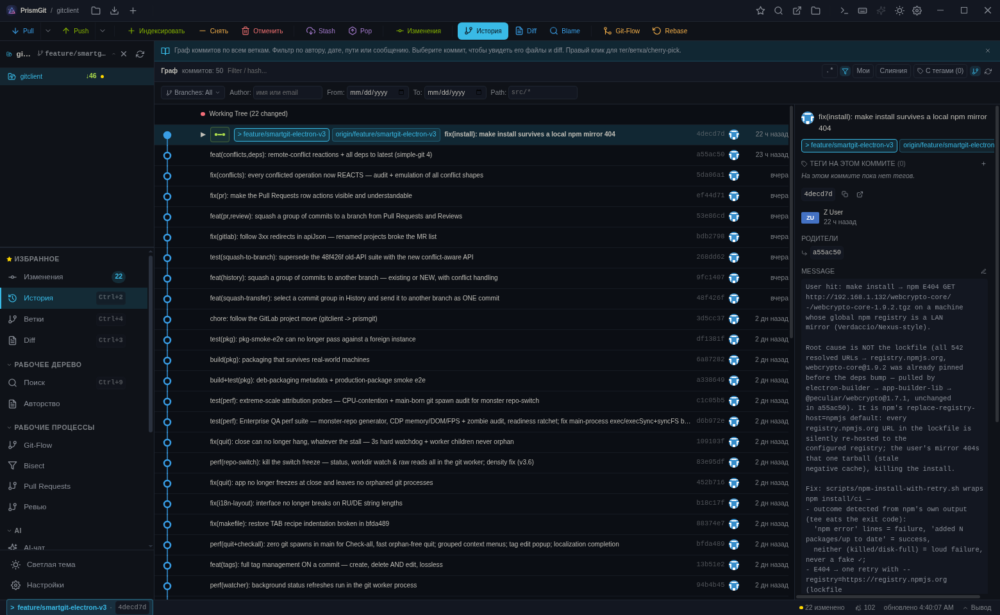
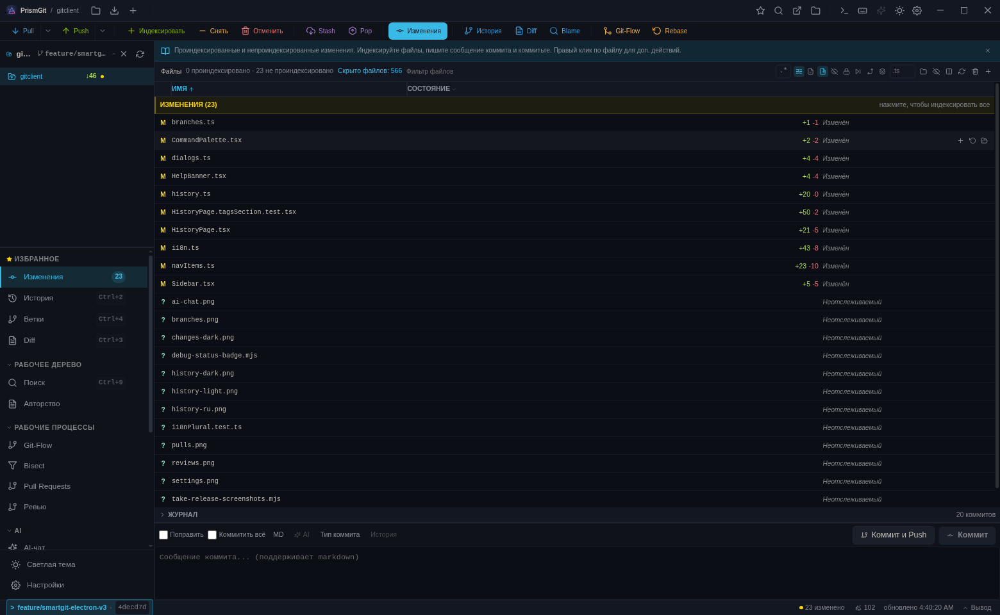

# PrismGit

[English](README.md) | **Русский** | [中文](README.zh.md) | [Deutsch](README.de.md)

Современный кроссплатформенный Git-клиент на Electron + React + TypeScript, вдохновлённый SmartGit 20–24, с дизайн-языком **Ollama-code** (палитры Ayu Dark/Light).



[](#) [](tests/) [](LICENSE) [](#) [](#)

## Быстрый старт

```bash
# Клонировать и установить
git clone <repo-url>
cd prismgit-electron
make install        # переживает 404 локального npm-зеркала — авто-повтор через registry.npmjs.org

# Разработка
make dev

# Сборка для текущей платформы
make package

# Тесты
make test

# Кроссплатформенная сборка через Docker
make docker-all
```

## Скриншоты

| | |
|:---:|:---:|
|  |  |
| **История** — граф всех ветвей, ленивая загрузка, фильтры | **Изменения** — группы «Индекс/Изменения», drag & drop |
|  |  |
| **Ветки** — локальные/удалённые, индикаторы синхронизации | **Pull Requests** — GitHub PR + GitLab MR |
|  |  |
| **Ревью** — 4 вкладки код-ревью | **AI-ассистент** — 12+ провайдеров, 24+ git-инструмента |
|  |  |
| **Настройки** — 20+ тем, 4 языка интерфейса | **История — светлая тема** (Ayu Light) |

## Что нового в 2.2.0

- **Каждая конфликтная операция теперь РЕАГИРУЕТ** — pull (merge/rebase/ff-only), merge, rebase, cherry-pick, revert, stash pop/apply, завершение git-flow, squash-to-branch и 3-way патч переходят в решатель конфликтов с баннером выполняемой операции (Продолжить / Пропустить / Прервать) и предупреждением. Git-Flow никогда не продолжает работу после конфликтного слияния; stash pop больше не сообщает ложный успех.
- **Восстановление после отклонения push** — non-fast-forward, устаревший force-with-lease, защищённая ветка и политические блокировки открывают диалог с действиями по причине: «Стянуть и слить» (+ автоматический повтор push), force-with-lease, «Fetch и повторить», создать merge request. Списки PR/MR показывают значки конфликтов от провайдера.
- **Сквош группы коммитов в другую ветку** — из Истории или из Pull Requests/Ревью, в существующую или НОВУЮ ветку, с обработкой конфликтов.
- **Аудит счётчиков** — чип «С тегами (N)» в Истории считает помеченные коммиты *в текущем представлении* (ровно столько, сколько покажет фильтр), счётчики тегов на коммите точны, сводка Веток согласуется по-русски (`1 локальная · 2 локальные · 5 локальных`), сайдбар следует языку, восстановленному при запуске.
- **Менеджер секретов** (Настройки → Безопасность) — список/копирование/замена/удаление каждой записи зашифрованного хранилища, только метаданные.
- **Все зависимости актуальны** — simple-git 4, Vite 8, Vitest 5, Tailwind 4, React 19, Electron 44 — плюс `make install`, самолечащий 404 локального npm-зеркала.
- **Производительность и стабильность** — watchdog завершения без сирот-процессов (3 с), переключение репозиториев и обновление статуса в git-воркере, изоляция перерисовок, deb-упаковка + производственный smoke E2E.

Полная история: [docs/CHANGELOG.ru.md](docs/CHANGELOG.ru.md)

## Возможности

### Рабочее дерево
- **Изменения** — индексация/снятие с индекса/восстановление/игнорирование/удаление/показ в Finder с drag & drop; настраиваемый журнал коммитов (`git log -N` — периодичность и количество в настройках)
- **Diff** — ленивая загрузка с LRU-кэшем на 20 записей, дебаунс 150 мс, редактируемый (открыть во внешнем редакторе → предложить индексировать)
- **История** — лог коммитов с графом, поиск, дерево файлов коммита, фильтры по автору/дате/пути, выбор нескольких ветвей, фильтр помеченных коммитов
- **Annotate** — встроенные аннотации с анализом перекрытий (SmartGit 24)
- **Investigate** — история файла с отслеживанием переименований
- **Blame** — построчное авторство с цветами коммитов

### Работа с конфликтами
- **Решатель конфликтов** — 3-панельный вид (База | Наше | Ихнее) с 4 раскладками; взять наше/ихнее по файлу; редактируемая центральная панель
- **Единая матрица реакций** — ЛЮБАЯ конфликтная операция (pull merge/rebase, merge, rebase, cherry-pick, revert, stash pop/apply, завершение git-flow, squash-to-branch, 3-way патч, авто-stash AI) открывает решатель с баннером (Продолжить/Пропустить/Прервать) + секцией «Конфликты» + операционным тостом
- **Диалог отклонения push** — non-fast-forward → «Стянуть и слить» + автоматический повтор push; устаревший lease → fetch и повтор; защищённая ветка → создать MR/PR; объяснение блокировок политикой
- **Значки конфликтов PR/MR** — GitLab `merge_status` / GitHub `mergeable` в списках и заголовке ревью; кнопка Merge заблокирована с подсказкой
- **Честная верификация push** — пост-проверка `ls-remote` ловит молчаливые серверные отклонения (хуки, прокси, не та ветка)

### Workflow
- **Git-Flow** — Feature/Release/Hotfix/Fix/Support со сценариями start/finish; настройка префиксов в стиле AVH; баннер инициализации; завершение останавливается на конфликтном слиянии (никаких тегов/удалений/push мимо конфликта)
- **Pull Requests** — единое управление GitHub PR + GitLab MR (список, создание, открытие, апрув, слияние, закрытие); подписанные кнопки в строках + контекстное меню; сквош группы в ветку
- **Ревью** — полный цикл код-ревью выбранного PR/MR, 4 вкладки:
  - **Обзор** — описание (markdown), сводная статистика (файлы/коммиты/комментарии)
  - **Коммиты** — список коммитов PR: sha, сообщение, автор, дата
  - **Файлы** — изменённые файлы со статусами, +/- счётчики, unified diff
  - **Обсуждение** — комментарии + поле ввода (Cmd/Ctrl+Enter для отправки)
- **Распределённые ревью** — офлайн код-ревью в git notes (`refs/notes/reviews`), push/fetch для команды
- **Сквош в ветку** — выберите группу коммитов в Истории (или PR) и приземлите её в другую ветву ОДНИМ коммитом — существующую или новую, с обработкой конфликтов

### Интеграция с провайдерами
- **Единое хранилище провайдера** — общий выбор между Pull Requests и Ревью
- **GitHub** — PAT-аутентификация, список/создание/слияние/закрытие PR, детали/файлы/коммиты/комментарии
- **GitLab** — PAT (облако + self-hosted), список/создание/слияние MR, детали/изменения/заметки/коммиты; прямое определение проекта по path_with_namespace; следование 3xx-редиректам (переименованные проекты)
- **Чип провайдера** — переключатель в заголовках страниц; автодетект по URL remote; ручной выбор сохраняется
- **Лог API-вызовов** — все HTTP-запросы GitHub/GitLab видны в панели «Вывод»: метод, путь, статус, длительность

### Ссылки (Refs)
- **Ветки** — локальные/удалённые, переключение, создание, переименование, удаление, слияние, push; индикаторы (gone, local-only, dirty); перетащите ветвь на другую для слияния
- **Теги** — аннотированные/легковесные, создание, удаление, push; группировка по RegEx; полное управление тегами НА коммите — создание, удаление И редактирование без потерь
- **Remotes** — добавить/удалить/изменить, управление учётными данными, фоновый fetch по каждому remote
- **Worktrees** — добавить, удалить, почистить (из контекстного меню Веток)
- **Reflog** — просмотр, удаление записей, cherry-pick/reset, фильтры по типу действия
- **Stashes** — push, pop, apply, drop, branch, rename; конфликты pop/apply открывают решатель (stash сохраняется)
- **Submodules** — init, update, sync, deinit, add
- **Git LFS** — install, pull, push, fetch, track, list, lock/unlock, fsck, untrack
- **Перерабатываемое** — восстановление недостижимых коммитов до истечения 90 дней

### Функции SmartGit 24
- **Интерактивный rebase** — визуальный редактор todo (pick/reword/edit/squash/fixup/drop)
- **Решатель конфликтов** — 3-панельный вид (База | Наше | Ихнее), 4 раскладки
- **Умные представления** — предустановленные фильтры графа (Все, Текущая ветвь, Мои коммиты, Недавние и т.д.)
- **Колонка перекрытий** — визуализация связанных коммитов
- **Поиск объекта** — поиск ветвей/тегов/remotes (Ctrl+F)
- **Разделение коммита** — через интерактивный rebase
- **Редактирование сообщения коммита** — встроенный редактор
- **Cherry Pick / Revert** — с детекцией конфликтов и управлением состоянием
- **Терпимый URL клонирования** — срезает префикс "git clone ", выводит имя папки

### AI-ассистент
- **12+ LLM-провайдеров** — Z.ai (GLM-4-Flash бесплатно), OpenRouter (бесплатные модели), Groq (сверхбыстрый), Cerebras (1 млн бесплатных токенов/день), Google Gemini, Hugging Face, Mistral, OpenAI, Anthropic, GitHub Models, Ollama (локально), LM Studio, vLLM, совместимый с OpenAI
- **Неограниченный реестр провайдеров** — сколько угодно экземпляров каждого типа
- **Переключатель провайдеров** — смена посреди диалога; история сохраняется
- **Память диалога** — AI помнит предыдущие сообщения в рамках сессии
- **Сжатие контекста** — старые сообщения сжимаются автоматически (настраиваемый максимум)
- **Показ токенов** — input/output/context после каждого ответа
- **Кнопка «Стоп»** — мгновенная отмена выполняемого запроса
- **AI Guard** — настраиваемые allow/confirm/deny для деструктивных git-действий (reset --hard, force push, clean, amend, stash drop)
- **Лимиты инструментов** — настраиваемые максимумы (лог, diff, контекст, таймаут запроса)
- **Агентный цикл с инструментами** — 24+ инструмента: get_status, get_log, get_diff, stage, commit, push, pull, checkout, merge, stash, discard_changes, sync_with_remote, abort_operation, list_repos, clone_repo, init_repo, open_repo, read_file, list_files и другие
- **Экспорт лога чата** в Markdown
- **Markdown-рендеринг** ответов — блоки кода, инлайн-код, жирный, списки
- **Чипы стартовых промптов** — частые вопросы в один клик
- **AI-сообщения коммитов** — плейсхолдер `@ai` в сообщении → генерация
- **AI-подсказчик имён ветвей** — kebab-case из изменённых файлов
- **Стриминг ответов** — SSE-парсер для всех 3 семейств провайдеров
- **Избранное** — сохранение и повторное использование частей диалогов

### Безопасность
- **Зашифрованное хранилище учётных данных** — токены, пароли remotes, AI-ключи, SSH-пароли через `safeStorage`
- **Менеджер секретов** (Настройки → Безопасность) — список только с метаданными; копировать / заменить / удалить каждую запись; добавить секрет вручную
- **Автор коммита по умолчанию** (Настройки → Git) — применяется к новым clone/init; `commit()` использует его как fallback
- **AI Guard** — подтверждение деструктивных действий

### Три стиля окна
- **Стандартное** — полный сайдбар + все страницы
- **Лог** — фокус на Истории (сайдбар скрыт)
- **Рабочее дерево** — фокус на Изменениях

Переключение: Ctrl+Shift+1/2/3 или кнопка в тулбаре.

### Темы (20+ палитр)
- **Ayu** Dark/Light (по умолчанию), GitHub Light/Dark, Dracula, Monokai, Solarized, Nord, Tokyo Night, Catppuccin Mocha, One Dark, Gruvbox, Slack Dark, Discord, Material, Designer Light, Purple, Simple Light

Переключение: Ctrl+Shift+T. Авто светлая/тёмная следуют за системной схемой.

### Производительность и настройки
- **Производительность git** — `feature.manyFiles`, `core.fsmonitor`, `fetch.writeCommitGraph` в Настройках → Git (через GIT_CONFIG, без глобального конфига)
- **Настраиваемый журнал** — количество коммитов журнала (5–100) и интервал обновления (0–300 с)
- **Авто-обновление Истории** — периодический `git log` (минимум 30 с)
- **Авто-push** — периодический push исходящих коммитов
- **Фоновый fetch по remote** — опционально для каждого remote
- **Адаптивный опрос** — буст (30 с) после git-мутаций, базовый (120 с) иначе; пауза при расфокусированном окне; фоновый статус remote в отдельном utility-процессе
- **Переключение репозитория в git-воркере** — статус, слежение за рабочей директорией и чтения вне UI-потока; watchdog завершения 3 с без сирот

## Интернационализация

4 локали с полной паритетностью по всем доменам i18n:
- **English** (en) — по умолчанию
- **Русский** (ru) — с корректными русскими формами множественного числа (движок `{n|one|few|many}`: «1 локальная · 2 локальные · 5 локальных»)
- **中文** (zh)
- **Deutsch** (de)

Тест паритетности (`tests/unit/i18nParity.test.ts`) гарантирует одинаковые наборы ключей во всех 4 локалях; en/zh/de рендерятся байт-в-байт как с простыми плейсхолдерами. Сайдбар, палитра команд и баннеры подсказок следуют языку, восстановленному из настроек при запуске.

## Панель «Вывод»

Панель «Вывод» (лог команд) фиксирует:
- **Git-команды** — каждый `git <args>` с stdout/stderr, кодом выхода, длительностью
- **API-вызовы** — HTTP-запросы GitHub/GitLab как синтетические записи (`api gitlab GET /projects/12/merge_requests/5`)
- **Фильтр «Пользователь / Система»** — по умолчанию только команды пользователя
- **Поиск** — по тексту команды, stdout или stderr

## Технологии

- Electron 44, React 19, TypeScript 7, Vite 8
- Tailwind CSS 4, Zustand 5, simple-git 4, electron-store
- Собственные SVG-иконки (без библиотек иконок)
- Vitest 5 + Testing Library — 1963 теста (unit / интеграционные с реальным git / компонентные)
- Живые E2E-харнесы — реакции на конфликты, отклонения push, аудит счётчиков (запущенное приложение + проверенные скриншоты)
- Docker + Wine для кроссплатформенной сборки

## Документация

- [Журнал изменений](docs/CHANGELOG.ru.md) · [EN](docs/CHANGELOG.md) · [ZH](docs/CHANGELOG.zh.md) · [DE](docs/CHANGELOG.de.md)
- [Архитектура](docs/ARCHITECTURE.md) (EN) — устройство системы и потоки данных
- [API](docs/API.md) (EN) — все git-операции и IPC-каналы
- [Содействие](docs/CONTRIBUTING.md) (EN) — настройка разработки и правила
- [Сборка в Docker](docs/DOCKER-BUILD.md) (EN) — мультиплатформенная сборка
- [Тестирование](docs/TESTING.md) (EN) — документация тестового набора

## Структура проекта

```
├── electron/                 # Главный процесс
│   ├── main.ts               # Точка входа, состояние окна, контекстное меню
│   ├── preload.ts            # Context bridge API
│   ├── menu.ts               # Меню приложения
│   ├── ipc/                  # IPC-обработчики
│   ├── services/             # Бизнес-логика
│   │   ├── git.ts            # Git-операции (simple-git, 6900+ строк)
│   │   ├── github.ts         # GitHub API-клиент
│   │   ├── gitlab.ts         # GitLab API-клиент (self-hosted + облако)
│   │   ├── commandLog.ts     # Лог git-команд и API-вызовов
│   │   ├── storage.ts        # Персистентные настройки
│   │   └── watcher.ts        # Слежение за файлами
│   └── types/                # TypeScript-контракты API
├── src/                      # Процесс рендера
│   ├── App.tsx               # Корень с ленивыми маршрутами и хоткеями
│   ├── components/           # UI-компоненты (55+ файлов)
│   ├── pages/                # Лениво загружаемые страницы
│   ├── stores/               # Zustand-сторы (12 штук)
│   ├── lib/                  # Утилиты и бизнес-логика
│   └── styles/               # Ayu Dark/Light + 20 тем
├── tests/                    # Vitest-набор (1963 теста)
│   ├── unit/                 # Unit-тесты (паритет i18n, gitflow и т.д.)
│   ├── integration/          # Интеграционные тесты (реальный git)
│   └── components/           # React-компонентные тесты
├── scripts/                  # Сборка + утилиты + живые E2E-скрипты
├── Dockerfile                # Мультиплатформенная Docker-сборка
├── docker-compose.yml        # 4 сервиса сборки
├── Makefile                  # Единый раннер задач
└── vitest.config.mts         # Конфигурация тестов
```

## Горячие клавиши

| Клавиши | Действие |
|----------|--------|
| Ctrl+O | Открыть репозиторий |
| Ctrl+Shift+O | Клонировать репозиторий |
| Ctrl+Enter | Коммит |
| Ctrl+Shift+P | Push |
| Ctrl+Shift+L | Pull |
| Ctrl+Shift+F | Fetch / Глобальный поиск |
| Ctrl+Shift+G | Диалог Git-Flow |
| Ctrl+Shift+R | Интерактивный rebase |
| Ctrl+Shift+N | Новая ветвь |
| Ctrl+Alt+S | Stash |
| Ctrl+Shift+T | Переключить тему |
| Ctrl+Shift+A | AI-ассистент |
| Ctrl+Shift+1/2/3 | Стиль окна (Стандартное/Лог/Рабочее дерево) |
| Ctrl+F | Поиск объекта |
| Ctrl+K | Палитра команд |
| Esc | Закрыть диалог |

## Сборка в Docker

Все сборки выполняются в Docker-контейнерах:

```bash
make docker-all          # Все платформы
make docker-linux        # Только Linux
make docker-win          # Windows (через Wine)
make docker-mac          # macOS Intel
make docker-mac-arm64    # macOS Apple Silicon
```

Подробнее: [docs/DOCKER-BUILD.md](docs/DOCKER-BUILD.md).

## Лицензия

MIT
